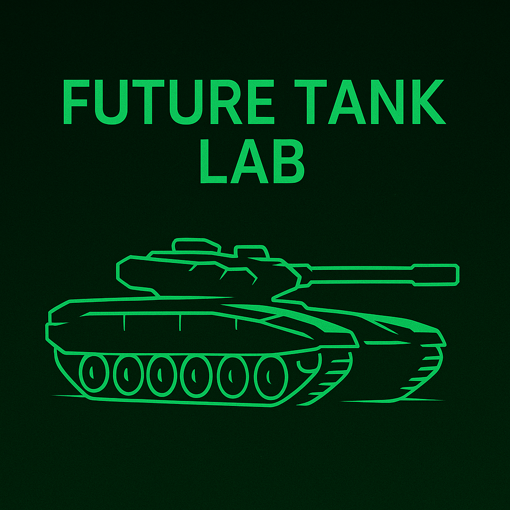

# 🛡 Future Tank Lab

**Future Tank Lab** is an interactive Streamlit application that demonstrates future armored vehicle concepts.  
It visualizes trade-offs across survivability, protection, mobility, weapons, sensors, crew, and speculative futurism.  
The app is educational — all models are simplified abstractions, not tied to real-world or classified performance.

---

## 🚀 Quick Start

### Requirements
- Python 3.10+
- Packages: `streamlit`, `numpy`, `pandas`

### Installation
```bash
git clone https://github.com/<your-username>/future-tank-lab.git
cd future-tank-lab
pip install streamlit numpy pandas
